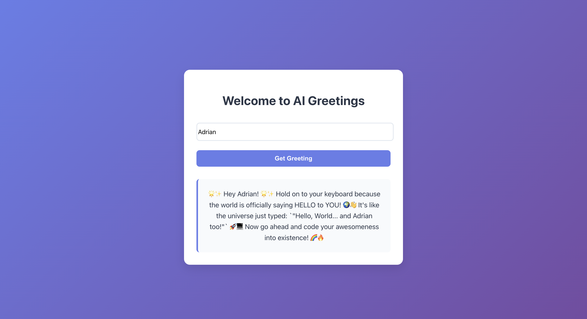

# Azure OpenAI Hello World Application

This project demonstrates a simple integration with Azure OpenAI's GPT-4o model to generate creative "Hello World" messages. The application consists of a Flask backend and a React frontend that allows users to get personalized greetings.

## Features

- Backend integration with Azure OpenAI's GPT-4o model
- Modern React frontend with a clean, responsive UI
- Personalized greeting generation based on user input
- Error handling and loading states
- CORS-enabled API endpoints

## Screenshots

### 1. Welcome Screen

*The clean and modern welcome screen of the application*

### 2. Input Form

*The form where users can enter their name*

### 3. Output Message

*The personalized greeting generated by Azure OpenAI*

### 4. Output Message

*The personalized greeting generated by Azure OpenAI*

## Prerequisites

- Python 3.8 or higher
- Node.js and npm
- Azure OpenAI service access
- Azure OpenAI API key and endpoint

## Getting Started from GitHub

1. Clone the repository:
   ```bash
   git clone https://github.com/AdityaBhanwadiya/HCI-Assignment-12.git
   cd HCI-Assignment-12
   ```

2. Follow the setup instructions below to configure and run the application.

## Project Structure

```
.
├── frontend/              # React frontend application
│   ├── src/
│   │   ├── App.js        # Main React component
│   │   └── App.css       # Styling
│   └── package.json      # Frontend dependencies
├── src/
│   ├── main.py           # Flask backend
│   └── config.py         # Configuration management
├── .env                  # Environment variables
└── requirements.txt      # Python dependencies
```

## Setup Instructions

### Backend Setup

1. Create a virtual environment:
   ```bash
   python -m venv venv
   source venv/bin/activate  # On Windows: venv\Scripts\activate
   ```

2. Install Python dependencies:
   ```bash
   pip install -r requirements.txt
   ```

3. Create a `.env` file in the root directory with your Azure OpenAI credentials:
   ```
   AZURE_OPENAI_API_KEY="your-api-key"
   AZURE_OPENAI_ENDPOINT="your-endpoint"
   AZURE_OPENAI_MODEL_NAME="gpt-4o"
   AZURE_OPENAI_DEPLOYMENT_NAME="your-deployment-name"
   AZURE_OPENAI_API_VERSION="2024-02-15-preview"
   ```

4. Start the Flask backend:
   ```bash
   python src/main.py
   ```
   The backend will run on http://127.0.0.1:5001

### Frontend Setup

1. Navigate to the frontend directory:
   ```bash
   cd frontend
   ```

2. Install dependencies:
   ```bash
   npm install
   ```

3. Start the development server:
   ```bash
   npm start
   ```
   The frontend will run on http://localhost:3001

## Usage

1. Open your browser and navigate to http://localhost:3001
2. Enter your name in the input field
3. Click "Get Greeting" to receive a personalized message
4. The message will be displayed below the form

## Error Handling

The application includes error handling for:
- Network connectivity issues
- API request failures
- Invalid user input

Error messages will be displayed to the user when issues occur.

## Reflection

This project provided valuable insights into several aspects of modern web development and AI integration:

### Technical Learnings
- **API Version Management**: Adapting to OpenAI's 1.0 API changes required careful attention to the new client initialization and method calls.
- **CORS Implementation**: Understanding and implementing proper CORS configuration was crucial for frontend-backend communication.
- **Environment Management**: Using `.env` files for configuration management proved essential for secure credential handling.
- **Error Handling**: Implementing comprehensive error handling at both frontend and backend levels improved application reliability.

### Development Challenges
- **Port Conflicts**: Resolving port conflicts with AirPlay on macOS required switching to alternative ports.
- **API Integration**: Navigating Azure OpenAI's specific authentication and endpoint requirements.
- **State Management**: Implementing proper loading states and error handling in the React frontend.
- **Cross-Origin Communication**: Setting up proper CORS configuration for development and production environments.

### Best Practices Adopted
- **Security**: Never exposing API keys in the codebase.
- **User Experience**: Implementing loading states and error messages for better user feedback.
- **Code Organization**: Separating frontend and backend concerns for better maintainability.
- **Error Handling**: Comprehensive error handling at both API and UI levels.

## Potential Applications

This project serves as a foundation for various real-world applications:

### Educational Tools
- **Interactive Learning**: Create engaging educational content with AI-generated responses.
- **Language Learning**: Develop language practice tools with personalized feedback.
- **Coding Education**: Generate example code snippets and explanations.

### Business Applications
- **Customer Service**: Build AI-powered greeting systems for websites and applications.
- **Personalization**: Create personalized marketing messages and content.
- **Employee Onboarding**: Develop interactive welcome experiences for new employees.

### Creative Projects
- **Interactive Art**: Create AI-powered interactive art installations.
- **Storytelling**: Develop dynamic storytelling applications.
- **Gaming**: Implement AI-driven character interactions and narratives.

### Technical Demonstrations
- **API Integration**: Showcase Azure OpenAI integration patterns.
- **Full-Stack Development**: Demonstrate modern web development practices.
- **AI Implementation**: Exhibit practical AI application development.